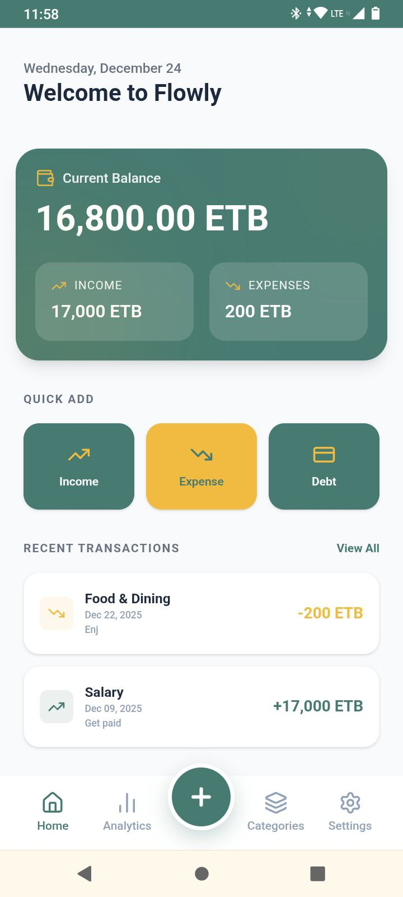
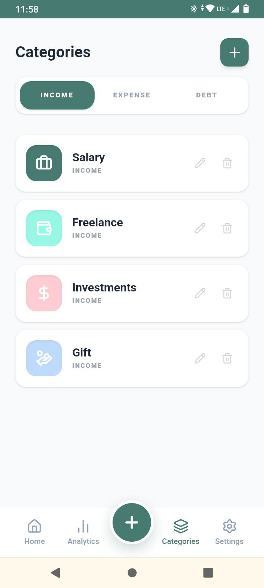
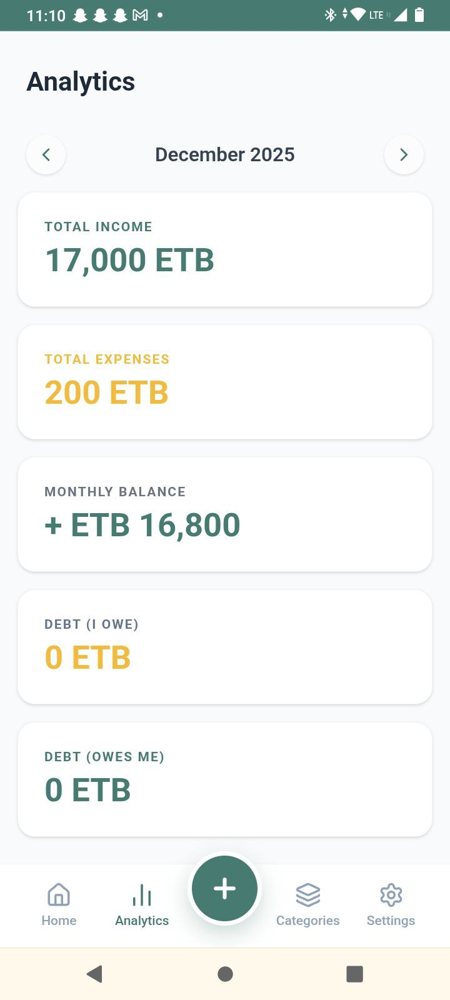
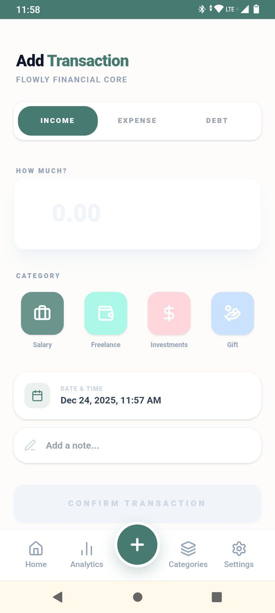

# Flowly - Personal Finance App

Flowly is a lightweight, privacy-focused personal finance tracker built for personal use. It runs entirely in the browser as a Progressive Web App (PWA), ensuring all your financial data stays on your device and is never sent to any server.

## Screenshots

<div align="center flex gap-2" >
  
  
  
  
</div>

## Features

- 💻 Fully offline-first Progressive Web App (installable on desktop and mobile)
- 📊 Track income, expenses, accounts, and custom categories
- 🔒 100% local storage – data never leaves your device
- 🗄️ Persistent storage using IndexedDB
- 🎨 Clean, responsive UI built with Tailwind CSS
- 🏗️ Structured with Clean Architecture principles for maintainability
- ⚡ Fast and lightweight (Next.js App Router)

## Tech Stack

- **Framework**: Next.js (App Router)
- **Styling**: Tailwind CSS
- **Database**: IndexedDB (local browser storage)
- **Architecture**: Clean Architecture
- **PWA**: Next.js PWA support with manifest and service worker

## Installation & Setup

### Local Development

1. Clone the repository
   ```bash
   git clone https://github.com/Lozaashenafi/flowly.git
   cd flowly
   ```

2.Install dependencies

````
npm install
# or yarn / pnpm / bun```

````

3. Run the development server

```
npm run dev
```
