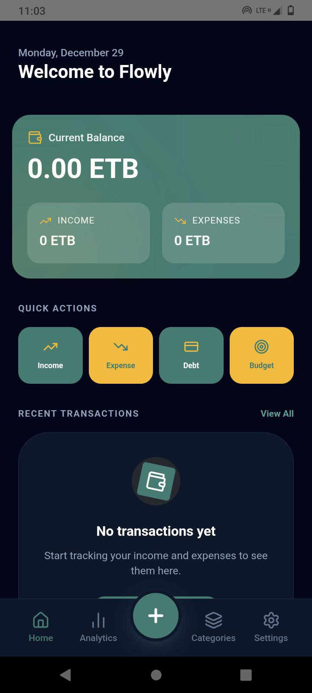

# Flowly - Personal Finance App

Flowly is a lightweight, privacy-focused personal finance tracker built for modern users. It runs entirely in the browser as a Progressive Web App (PWA) and is also available as a native Android application. Flowly ensures all your financial data stays on your device and is never sent to any server.

## Screenshots

<div align="center flex gap-2" >
  
  
  
  
</div>

## Features

- 💻 **Offline-First**: Fully functional without an internet connection.
- 📱 **Multi-Platform**: Use it as a Web App, PWA, or a native Android app (via Capacitor).
- 💰 **Budget Management**: Set monthly spending limits for specific categories to stay on track.
- 🌓 **Appearance**: Full support for Light and Dark modes.
- 📊 **Comprehensive Tracking**: Track income, expenses, accounts, and custom categories.
- 🔒 **Privacy-Centric**: 100% local storage – data never leaves your device.
- 🗄️ **Persistent Storage**: Uses IndexedDB for reliable local data management.
- ⚡ **Fast UI**: Clean, responsive interface built with Tailwind CSS.
- 🏗️ **Clean Architecture**: Structured for high maintainability and scalability.

## Tech Stack

- **Framework**: Next.js (App Router)
- **Mobile Bridge**: [CapacitorJS](https://capacitorjs.com/) (for Android deployment)
- **Styling**: Tailwind CSS
- **Database**: IndexedDB (Local browser storage)
- **Architecture**: Clean Architecture
- **PWA**: Next.js PWA support with manifest and service workers

## Installation & Setup

- **For application** : [flowly](https://flowly-show.vercel.app/)

### Local Web Development

1. **Clone the repository**
   ```bash
   git clone https://github.com/Lozaashenafi/flowly.git
   cd flowly
   ```

2.Install dependencies

````
npm install
# or yarn / pnpm / bun```

````

3. Run the development server

```
npm run dev
```
